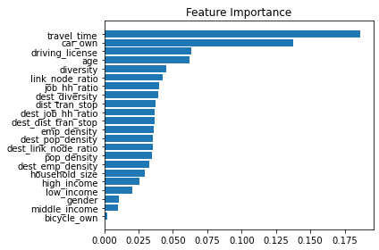

# Built environment influence on commute mode choice in a global south megacity context: Insights from explainable machine learning approach

The study aims to investigate the influence of built environment (BE) on commuters' mode choice in a densely packed megacity, Dhaka. The approach utilises machine learning methodologies to accurately model the influencing factors of mode choice, based on 10,150 home-based trips collected from Dhaka city, the capital of Bangladesh. Three machine learning classifiers were compared and based on the predictive performance, Random Forest algorithm was chosen to discover further insights. Relative importance of the BE factors were explored as well as the non-linear relationships between them and mode choice.

Our exploration shows that the BE factors substantially impacts commuter travel behaviour more than socio-demographic factors. Private car use is seen to be lower due to some certain BE characteristics. The study findings can have major implications for urban environmental policy and land use planning for transportation.

## Project Workflow

The workflow for the project is as follows:

* Data preparation which includes importing the data, converting the format, exploring and understanding the data, finding outliers, and make necessary changes to prepare for best model outcome.

* Classifier comparison based on grid search and K-fold cross-validation.

* Feature selection based on feature importance. The cumulative relative importance of the factors on the mode choice is also explored.

* Accumulated Local Effects (ALE) plot to explore the non-linear relation between mode choice and BE factors.

* Partial Dependance Plot (PDP) to investigate the interaction between mode choice and selected BE factors. Also, interaction among the BE factors were explored.

* H-statistics estimation to explore the interaction between BE factors and commuting time and car ownership.

## Requirements
- Pandas
- NumPy
- Matplotlib
- Seaborn
- Pickle
- Datetime
- Sklearn
- Imblearn
- Sklearn_gbmi

Python Version: 3.7

## Data pre-processing
The data was in .SAV format tailored to SPSS software, which was converted to a dataframe. One of the independant variable, `Destination Link Node Ratio` had 0 values in the data which were dropped as anomalous points.

Numeric features were scaled before pushing them through the grid search pipeline. Although scaling does not matter for classifiers based on decision tree algorithm, it was done for the Support Vector Machine (SVM).

Dependant class, the mode choice, was also unbalanced which would have affected the classifiers greatly. To avoid this, we utilised `Synthetic Minority Oversampling Technique (SMOTE)` to resample the data based on the non-majority class.

*Figure: Class distribution* 

*Figure: Variables distirbution* 

After scaling, the processed data was split in to 70/30 ratio for training and testing.

## Classifier Comparison
Gradient Boosting (GB), Random Forest (RF), and Support Vector Machine (SVM) were chosen for comparison. Cross-validation was performed on 10-folds and compared based on accuracy. The parameters tested with cross-validations are:

| Classifier    | Hyper-parameter               | Hyper-parameter Grid |
| --------------| ------------------------------| ---------------------|
| RF            | Number of estimators/Trees    | 100, 500, 1000       |
| RF            | Criterion                     | Gini, Entropy        |
| RF            | Maximum Depth                 | 1-10 (steps of 2)    |
| GBDT          | Number of estimators/Trees    | 100, 500, 1000       |
| GBDT          | Learning Rate                 | 1e-5, 1e-2, 0.1      |
| GBDT          | Maximum Depth                 | 1-10 (steps of 2)    |
| GBDT          | Maximum Feature               | Sqrt, Log2           |
| SVM           | C (Regularization parameter)  | 1e-2, 0.1, 1         |
| SVM           | Kernel                        | Linear, Poly, RBF, Sigmoid|
| SVM           | Decision Function             | One-vs-Rest (‘OVR’), One-vs-One (‘OVO’)           |

Based on the weighted F1-score, we chose Random Forest algorithm for further analysis.

*Figure: Classifier comparison result*

*Figure: Random Forest classification matrix*

## Feature Importance

Decision tree models can be used to estimate the feature importance, which refers to the influence of the variables on the overall prediction of the classes or global feature importance. This can also be used to estimate the cumulative importance of the factors.

*Figure: Feature importance*

## Non-Linear Relation Identification with ALE
Accumulated Local Effects can interpreted as the unbiased alternative to partial dependance plot to investigate teh non0linear nature of factors compared to the predictions.

*Figure: ALE plot for BE factors related to origin*

*Figure: ALE plot for BE factors related to destination*

## H-statistics

*Figure: Interaction between BE factors at residence and workplace*

## Authors
F.R. Ashik a,f(fajle.ashik@mail.mcgill.ca)

A.I.Z. Sreezon b (atif.sreezon@coact.org.au)

M.H. Rahman C (hamidur.rahman@utexas.edu)

N.M. Zafri d (zafri@urp.buet.ac.bd)

S.M. Labib e, * (s.m.labib@uu.nl)

a Department of Geography, McGill University, 805 Sherbrooke St W, Montreal, Quebec H3A 0B9, Canada

b School of Computer Science, Queensland University of Technology (QUT), Australia

c Community and Regional Planning, The University of Texas at Austin, 310 Inner Campus Drive B7500, Austin, TX 78705, United States

d Department of Urban and Regional Planning, Bangladesh University of Engineering and Technology (BUET), Dhaka, Bangladesh

e Department of Human Geography and Spatial Planning, Faculty of Geosciences, Utrecht University, 3584, CB, Utrecht, the Netherlands

f Accident Research Institute, Bangladesh University of Engineering and Technology (BUET), Dhaka 1000, Bangladesh

\* Corresponding author